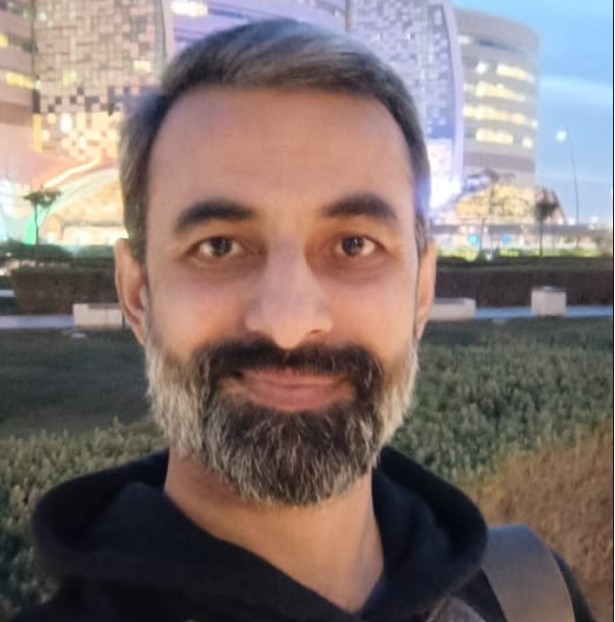
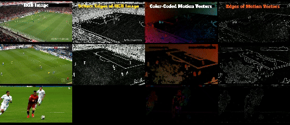

 
# Fahad Majeed 

### PhD Scholar | Computer Vision Researcher | Sports Video Analyst
I am a **PhD Scholar in Computer Vision** with over **8 years of cross-disciplinary experience** in academia and industry. My core expertise lies in designing **deep learning-based pipelines** for solving complex challenges in **sports video analytics**, and **large-scale data processing**. I develop end-to-end systems that combine **computer vision**, **graph theory**, **AI**, and **big data technologies** to deliver robust, scalable, and high-impact solutions. My research pushes the boundaries of AI for **human activity understanding**, **real-time tracking**, **pose estimation**, **event detection**, and **instance segmentation**, particularly in domains like **sports performance analysis**.

  
  
  

---
## 🎓 Areas of Interest

- 📌 **Thesis Focus**: Multi-modal Deep Learning & Graph-based Reasoning for Player Behavior Understanding in Sports Videos  
- 🧠 **Specializations**: Object Detection, Instance Segmentation, Graph Neural Networks (GNN), Feature Pyramid Networks (FPN), Temporal Modeling  
- ⚽ **Sports AI**: Real-time player tracking, tactical analytics, multi-camera calibration, ball trajectory prediction  
- ☁️ **Big Data**: Distributed video annotation pipelines using Apache Spark, Pig Latin, and cloud-based GPU processing

---

## 📈 Key Technical Skills

### 🧠 Machine Learning / Deep Learning
- PyTorch, TensorFlow, Scikit-learn, Keras, Detectron2, MMDetection
- CNNs, RNNs, Transformers, Attention Mechanisms, SepFormer
- Graph Neural Networks (GCN, GAT, ST-GCN)

### 📊 Computer Vision
- Object Detection (YOLOv3/5/7/8/9/10/11/12/YOLOE, Faster R-CNN, Mamba-YOLO)
- Instance Segmentation (Mask R-CNN), MedSAM2 for 3D Medical Image Segmentation
- Multi-object Tracking (SORT, OC-SORT, Deep SORT, ByteTrack, and BoTSORT)
- Pose Estimation (OpenPose, HRNet, Mediapipe)

### 🔗 Graph Learning & Temporal Analysis
- GCNConv, EdgeConv, ST-GCN
- Spatio-temporal adjacency modeling
- Action prediction from pose graph sequences

### ⚙️ Tools & Platforms
- Python, MATLAB, Bash, Git, Docker, LaTeX, REST APIs
- Jupyter Notebooks, PyCharm, VSCode
- Streamlit, Flask
- Kaggle, Google Colab

---

## 📚 Projects

### ⚽ Intelligent Soccer Analytics Framework
A modular pipeline integrating:
- Deep instance segmentation to detect players
- Graph-based spatial-temporal reasoning to model interactions
- Pose-based action recognition and team formation detection  
👉 Used in performance evaluation and tactical insights.

### 📹 Real-time Multi-camera Video Analytics
- Camera calibration and homography estimation
- Player re-identification using feature embedding + appearance descriptors
- Action tube generation and spatio-temporal event localization  
👉 Built for large-scale soccer datasets with over 1000+ video hours.

---

## 🧪 Publications
- **"Real-time analysis of soccer ball–player interactions using graph convolutional networks for enhanced game insights"**, Scientific Reports, 2025, Nature Portfolio. 
- **"ReST: High-Precision Soccer Player Tracking via Motion Vector Segmentation "**, 20th VISAPP Conference, 2025, Porto, Portugal.
- **"MV-Soccer: Motion-Vector Augmented Instance Segmentation for Soccer Player Tracking"**, 10th CVSports Workshops (CVPRW), 2024, Seattle, USA. 

---

## 🧬 Datasets

- **SoccerNet**, **SoccerNet-Tracking**, **FIFA World Cup Data**, **OpenPose**, **BraTS**, **ATLAS (ISLES 2022) Challenge Dataset**
- Annotated custom datasets using CVAT, LabelMe, Makesense.ai, and Roboflow.

---

## 💼 Professional Experience

- **Teaching & Mentorship**:  
  Taught undergraduate courses in Computer Science (BS level)  
  Supervised undergraduate research projects and thesis in CV/AI/IoT/ML domains  

- **Industry Projects**:  
  Worked on AI-driven medical diagnostics, surveillance systems, and sports tech for startups and research labs.
  
---
  
---

## 📫 Contact

📧 [fahad_majeed@yahoo.com](mailto:fahad_majeed@yahoo.com)  
📍 [Education City, Qatar Foundation, Doha, Qatar](https://www.google.com/maps/place/Education+City,+Doha,+Qatar)  
🌐 

---

> “Research is the art of seeing what everyone else has seen, but thinking what no one else has thought.”  
> – Fahad Majeed
